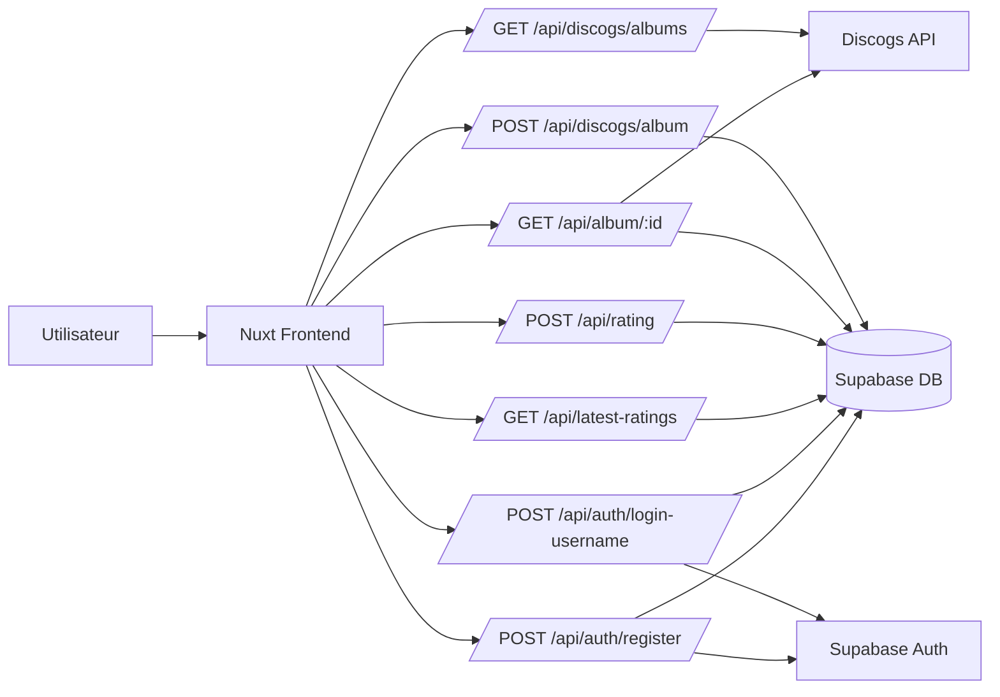
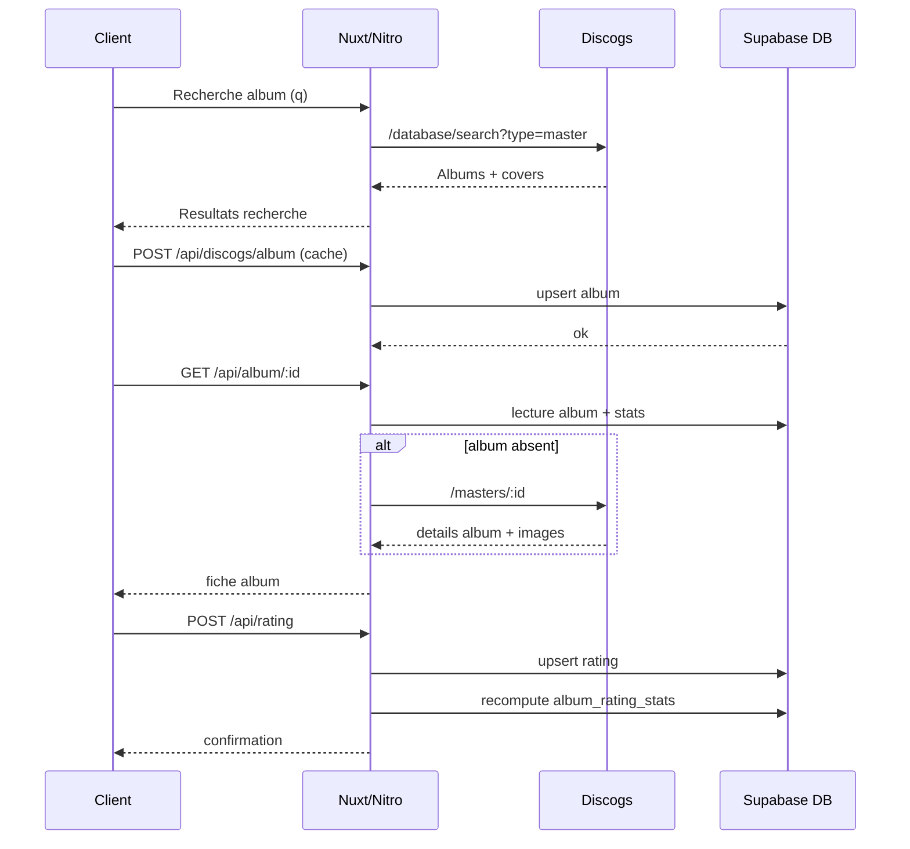
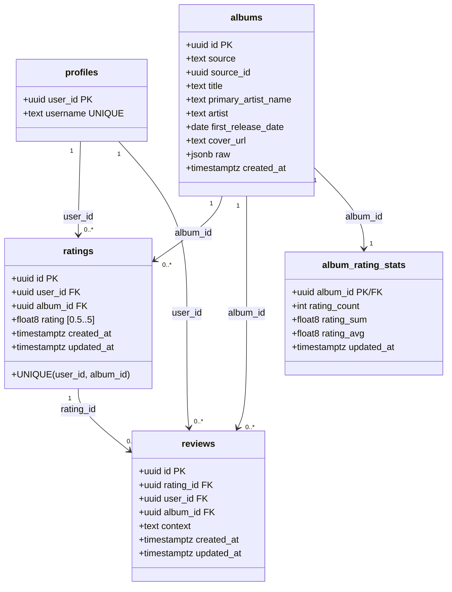
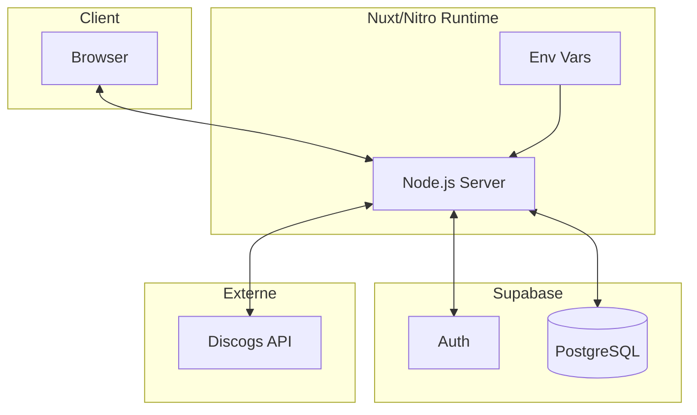

# MusicHub - Documentation Technique

---

## Table des matières

1. Contexte et objectifs
2. Guide d'installation du projet
3. Architecture applicative 
4. Modèle de données
5. Architecture d'infrastructure
6. Exigences techniques et sécurité
7. Annexes

---

## 1) Contexte et objectifs

MusicHub est une application permettant de rechercher et noter des albums et visualiser des notations des autres utilisateurs de la communauté.

Objectifs techniques :

- Fournir une interface web réactivwe et responsive
- Centraliser la logique métier dans des routes serveur Nuxt (Nitro)
- Persister les donnees utilisateurs et métadonnées dans Supabase
- Récuperer les métadonnées albums et covers via l'API Discogs
- maintenir des statistiques de notation agrégés par album.

---

## 2) Guide d'installation du projet

### 2.1 Prérequis

- Node.js >= 20
- pnpm >= 10
- Compte Supabase (URL + clés)
- Token Discogs (nécessaire pour la récupération des images)

### 2.2 Configuration environnement

Créer ou compléter le fichier `.env` à la racine :

```bash
DISCOGS_TOKEN=your_discogs_token

SUPABASE_URL=...
SUPABASE_KEY=...
SUPABASE_SECRET_KEY=...
```

### 2.3 Installation et exécution

```bash
pnpm install
pnpm dev
```

Application locale : `http://localhost:3000`

### 2.4 Migrations base de données

Les migrations SQL sont situées dans `supabase/migrations` :

- `20260227143902_init_schema.sql` : schema initial
- `20260301120000_auth_profile_trigger.sql` : trigger profil auto
- `20260316000000_fix_ratings_float_and_schema.sql` : ratings en decimal

---

## 3) Architecture applicative

### 3.1 Vue logique

Le système suit une architecture 3 couches :

- **Présentation** : pages Vue/Nuxt (`app/pages`)
- **Application/API** : routes Nitro (`server/api`)
- **Données** : Supabase PostgreSQL + Auth

La source externe pour le catalogue albums est l'API de Discogs.

### 3.2 Diagramme d'architecture logicielle




### 3.3 Flux de données principal




---

## 4) Modèle de données

### 4.1 Entités

- `profiles`
- `albums`
- `ratings`
- `reviews`
- `album_rating_stats`

### 4.2 Diagramme UML




---

## 5) Architecture d'infrastructure

### 5.1 Composants d'infrastructure

- Navigateur utilisateur
- Runtime Node.js (Nuxt/Nitro)
- Supabase (Auth + PostgreSQL)
- Discogs API (service externe)
- Variables d'environnement serveur (`DISCOGS_TOKEN`, `SUPABASE_*`)

### 5.2 Diagramme d'infrastructure




---

## 6) Exigences techniques et sécurité

### 6.1 Exigences fonctionnelles

- recherche d'albums ;
- consultation de détails album ;
- notation utilisateur (0.5 à 5) ;
- affichage des notations récentes ;
- consultation de profil public.

### 6.2 Exigences non fonctionnelles

- réactivite UI (Nuxt + SSR/hydratation) ;
- maintenabilité (TypeScript + séparation `app/` et `server/`) ;
- cohérence des données via contraintes SQL et upsert ;
- performance correcte via cache en base de données des albums.

### 6.3 Sécurité

- secrets uniquement cote serveur (`SUPABASE_SECRET_KEY`, `DISCOGS_TOKEN`) ;
- routes sensibles protegées par vérification utilisateur (`serverSupabaseUser`) ;
- service rôle utilisé côté serveur pour opérations admin ;
- contrôle de validation d'entrées sur les payloads API.

---

## 7) Annexes

### 7.1 Endpoints internes principaux

- `GET /api/discogs/albums`
- `POST /api/discogs/album`
- `GET /api/album/:id`
- `POST /api/rating`
- `GET /api/latest-ratings`
- `POST /api/auth/login-username`
- `POST /api/auth/register`
- `GET /api/profile/:username`

### 7.2 Structure de projet

```text
app/
  pages/
  components/
server/
  api/
  utils/
supabase/
  migrations/
docs/
```

